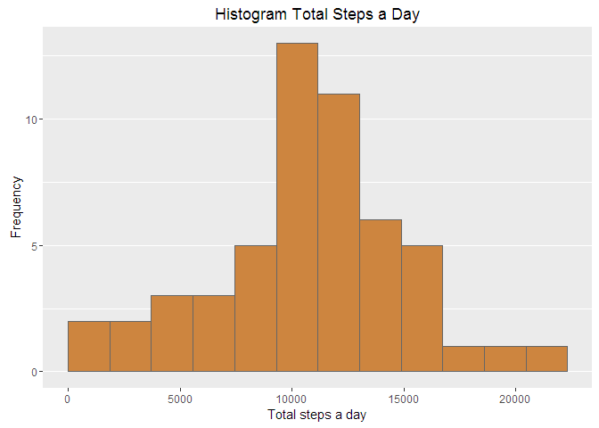
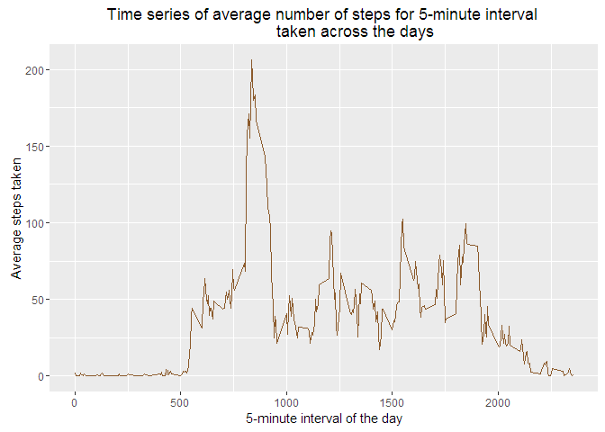
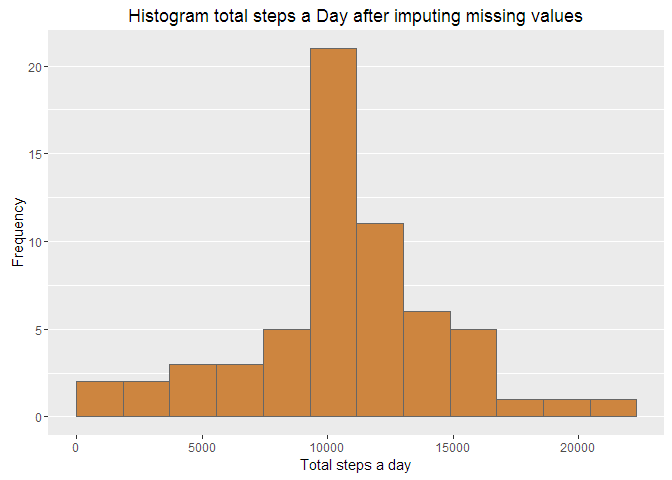
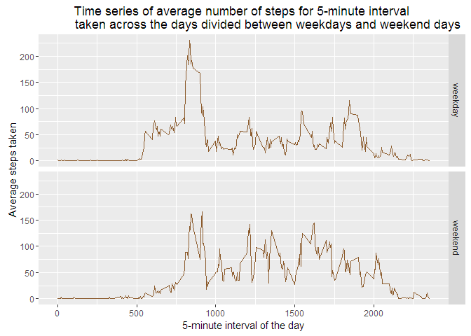

# Reproducible Research: Peer Assessment 1


## Loading and preprocessing the data

Load the data from the csv file.

```r
setwd("F:/Coursera/Data_Science/Reproducible_Research/Week_2")
activity <- read.csv("activity.csv")
```
Reformat variable 'date' to date format and make a 'clean' set of data that doesn't contain NA values for variable 'steps'.

```r
activity$date <- as.Date(activity$date,"%Y-%m-%d")
activityClean <- activity[!is.na(activity$steps),]
```

## What is mean total number of steps taken per day?

First calculate the total number of steps taken per day. The dplyr package is used.

```r
library(dplyr)
groupsDay <- group_by(activityClean, 
                      date)
totStepsDay <- summarise(groupsDay, 
                         sum.steps = sum(steps, rm.na = TRUE))
```

Second show a histogram of the total number of steps taken each day using ggplot2

```r
library(ggplot2)
hist <- ggplot(totStepsDay, aes(sum.steps))
hist + geom_histogram(na.rm = TRUE,
                      boundary = 0, 
                      binwidth = 1860, 
                      fill="tan3", 
                      color="grey40") +
    theme(panel.grid.major.x = element_blank(),
          panel.grid.minor.x = element_blank()) +
    labs(list(title = "Histogram Total Steps a Day", 
              x = "Total steps a day",
              y = "Frequency"))
```

<!-- -->

Calculate and report the mean and median of the total number of steps taken per day.

```r
library(dplyr)
groupsTot <- group_by(totStepsDay)
totStepsDayStats <- summarise(groupsTot, 
                              mean.sum.steps = mean(sum.steps), 
                              median.sum.steps = median(sum.steps))
mean <- round(totStepsDayStats$mean.sum.steps, digits=2)
```

Mean total steps per day: 10767.19  
Median total steps per day: 10766

## What is the average daily activity pattern?

Calculate the average number of steps for each interval across all days as preparation for the time series plot.

```r
library(dplyr)
groupsInt <- group_by(activityClean, 
                      interval)
avgStepsInt <- summarise(groupsInt, 
                         avg.steps = mean(steps))
```

Make a time series plot

```r
library(ggplot2)
time <- ggplot(avgStepsInt, aes(interval,avg.steps))
time + geom_line(color = "tan4") +
    labs(list(title = "Time series of average number of steps for 5-minute interval 
              taken across the days", 
              x = "5-minute interval of the day",
              y = "Average steps taken"))
```

<!-- -->

Determine which 5-minute interval contains the maximum number of steps on average

```r
maxAvgStepsInt <- avgStepsInt[avgStepsInt$avg.steps==max(avgStepsInt$avg.steps),]
maxSteps <- round(maxAvgStepsInt$avg.steps, digits=2)
```
The interval containing the maximum average steps is: 835  
With a maximum average steps of: 206.17 

## Imputing missing values

Calculate and report the total number of missing values in the dataset.

```r
nbrNA <- nrow(activity[is.na(activity$steps),])
percNA <- round(mean(is.na(activity$steps))*100,digits = 2)
```
Total number of missing values in the dataset: 2304.  
This is 13.11% of the total dataset.

Use the average steps per interval calculated across all days to impute the missing values in the original dataset.  
Create a new dataset from the original dataset with the missing values imputed

```r
activityImp <- activity
activityImp$steps[is.na(activityImp$steps)] <- avgStepsInt$avg.steps
```

Calculate the total number of steps taken per day for the imputed dataset as preparation for the histogram.

```r
library(dplyr)
groupsImpDay <- group_by(activityImp, 
                      date)
totStepsImpDay <- summarise(groupsImpDay, 
                         sum.steps = sum(steps, rm.na = TRUE))
```

The histogram belonging to the imputed dataset.

```r
library(ggplot2)
hist <- ggplot(totStepsImpDay, aes(sum.steps))
hist + geom_histogram(na.rm = TRUE,
                      boundary = 0, 
                      binwidth = 1860, 
                      fill="tan3", 
                      color="grey40") +
    theme(panel.grid.major.x = element_blank(),
          panel.grid.minor.x = element_blank()) +
    labs(list(title = "Histogram total steps a Day after imputing missing values", 
              x = "Total steps a day",
              y = "Frequency"))
```

<!-- -->

Calculate and report the mean and median of the total number of steps taken per day after imputation.

```r
library(dplyr)
groupsImpTot <- group_by(totStepsImpDay)
totStepsImpDayStats <- summarise(groupsImpTot, 
                              mean.sum.steps = mean(sum.steps), 
                              median.sum.steps = median(sum.steps))
meanImp <- round(totStepsImpDayStats$mean.sum.steps, digits=2)
```

Mean total steps per day: 10767.19  
Median total steps per day: 10767.1886792

The mean didn't change. This is logical when looking the imputed values were the mean values per interval.
This is also reflected in the histogram. Just the bin containing the mean increased.
The median converted towards the mean.

## Are there differences in activity patterns between weekdays and weekends?

Create a new factor variable in the dataset with two levels "weekday" and "weekend". Basis is the new dataset with imputed missing values.

```r
library(lubridate)
activityImp$weekdayInd <- factor(ifelse(wday(activityImp$date, 
                                             label = FALSE) %in% c(1,7), 
                                        "weekend", 
                                        "weekday"), 
                                 levels = c("weekday","weekend"))
```

Panel plot with time series divided between weekday and weekend days. 

```r
library(dplyr)
groupsImpInt <- group_by(activityImp,
                         weekdayInd,
                         interval
                        )
avgStepsImpInt <- summarise(groupsImpInt, 
                         avg.steps = mean(steps))

library(ggplot2)
timeWd <- ggplot(avgStepsImpInt, aes(interval,avg.steps))
timeWd + geom_line(color = "tan4") + facet_grid(weekdayInd ~ .) +
    labs(list(title = "Time series of average number of steps for 5-minute interval 
              taken across the days divided between weekdays and weekend days", 
              x = "5-minute interval of the day",
              y = "Average steps taken"))
```

<!-- -->
